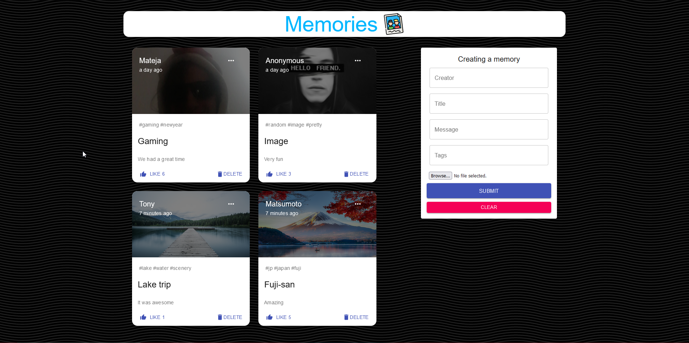

# React Memories

A simple full stack SPA web application for recording travel memories or memories from other events. This was built using the **MERN** (MongoDB, Express , React, Node.js) stack.

### Preview

## TODO:
- [X] Set routes on backend
- [X] Create a collection on MongoDB Atlas
- [X] Create a memory model
- [X] Seperates routes and their callback functions into controllers
- [X] Use create-react-app
- [X] Apply Material UI
- [X] Make a Post component
- [X] Make a Form component
- [X] Make a seperate component to fill in with multiple Post components
- [X] Make the Form component functional
- [X] Clear button for clearing the input fields
- [X] Add functionality for updating and deleting posts
- [X] Add a like button (no user likes)
- [ ] Make the Post component look better
- [ ] Add a like functionality (1 like on Post per user)
- [ ] Search functionality
- [ ] Tag based search
- [X] Add mobile responsiveness
- [ ] Add JWT and Google OAuth
- [ ] Deploy (Maybe?)